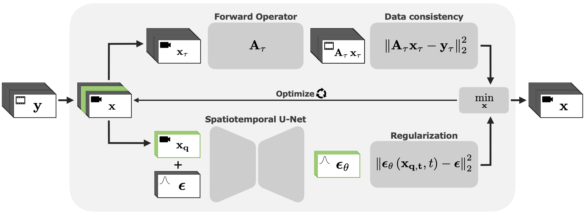

# Piecewise Dynamic Diffusion Regularization

This repository provides methods and experiments necessary to reproduce the results presented in \
"Piecewise Dynamic Diffusion Regularization for Reconstruction of Cardiac Cine MRI". \
The paper proposes Piecewise Dynamic Diffusion Regularization (PDDR), a reconstruction framework that integrates a pretrained spatiotemporal diffusion model as a generative prior for cardiac videos. Within a variational reconstruction scheme, PDDR enforces measurement consistency while leveraging the dynamic prior in a piecewise manner, enabling efficient processing of long real-time sequences.



## Usage

### Setup
To set up the environment define a `base_directory` where you want to store datasets, models, and results. \
Then run
```
bash setup.sh /path/to/base_directory
```
This creates the directory structure, installs Python dependencies via pip, and installs the BART MRI toolbox.


### Data availability
Only the following public datasets are considered:

- CMRxRecon 2023: [[download site]](https://www.synapse.org/Synapse:syn51471091/datasets/)  [[paper]](https://doi.org/10.1038/s41597-024-03525-4) 
- CMRxRecon 2024: [[download site]](https://www.synapse.org/Synapse:syn54951257/datasets/)  [[paper]](https://doi.org/10.1148/ryai.240443) 
- OCMR: [[download site]](https://www.ocmr.info)  [[paper]](https://arxiv.org/abs/2008.03410) 

You need to download and unpack the data yourself. See expected structure below. 


### Data preprocessing
The provided data are multi-coil k-space measurements. For fast and accessible data handling in training and reconstruction, the data needs to be preprocessed. 

We estimate the sensitivity maps using [BART](https://github.com/mrirecon/bart/tree/master), and store them together with the fully sampled (binned) k-space measurements and the MVUE images. 
Prospective OCMR data is stored with undersampling masks and measurement information, but without images. 

Preprocessing expects the data to be stored in the following directory structure:
```
└── data_directory/                             # Set directory where all unpacked data is stored. Defaults to /path/to/base_directory/datasets
    ├── CMRxRecon2023/                          # Set directory for 2023 CMRxRecon data. Lower level directories due to the provided download structure.
    │   ├── ChallengeData/...                   
    │   └── ChallengeDataAfterCompetition/      
    │       ├── ChallengeData_validation/...
    │       └── ChallengeData_test/...
    ├── CMRxRecon2024/                          # Set directory for 2024 CMRxRecon data. Lower level directories due to the provided download structure.
    │   ├── ChallengeData/...                   
    │   └── ChallengeDataAfterCompetition/...         
    └── OCMR                                    # Automatic directory setup and data download when running preprocessing.
         └── prospective/           
            ├── healthy/...       
            ├── patient/...
            └── short/...
````
Missing data directories are skipped. The default data directory is `/path/to/base_directory/datasets`.

Run preprocessing by
```
python preprocess/preprocess_cmr.py -b /path/to/base_directory [-d /path/to/data_directory]
python preprocess/preprocess_ocmr.py -b /path/to/base_directory [-d /path/to/data_directory]
```
Processed files are stored in an appropriate format (.h5) under `base_directory/datasets/CineProcessed/...`.


### Model training 
Training the dynamic diffusion prior for cardiac cine MRI.

To configure the diffusion model and training process edit:
- `configs/diffusion.yaml`: Define the model architecture and diffusion model parameters.
- `configs/training.yaml`: Define training data, optimizer parameters, and output directory.

Best practice for GPU handling is setting `CUDA_VISIBLE_DEVICES`.

Run model training by
```
python scripts/train_model.py -b /path/to/base_directory [-t /path/to/training_config] [-d /path/to/diffusion_config]
```
Models are stored under `base_directory/models/...`. \
Tensorboard logs for monitoring are stored under `base_directory/models/<model_name>/logs`.


### Reconstruction 
Reconstruction of a single cardiac video from undersampled k-space data.

To configure the reconstruction process edit:
- `configs/inference.yaml`: Define data, model, and inference parameters for reconstruction.

Best practice is setting `CUDA_VISIBLE_DEVICES` to a single GPU.

Run reconstruction by
```
python scripts/reconstruct.py -b /path/to/base_directory [-i /path/to/inference_config]
```
Reconstruction results are stored under `base_directory/experiments/...`. 


### Reproducing experimental results
Evaluation of reconstruction methods. \
Runs reconstructions for a given dataset, evaluates performance metrics, and stores a results summary. \
Can be used for hyperparameter ablations, by providing lists of parameter values for the intended hyperparameters.

To configure the experiment edit:
- `configs/experiment.yaml`: Define data, model, and inference parameters for reconstruction.

For reproducing the presented results, experimental configurations are given:
- `configs/reproduce/experiment_*.yaml`: Defines respective experimental setup, e.g. for baseline evaluation.

Best practice is setting `CUDA_VISIBLE_DEVICES` to a single GPU.

Run experiment by
```
python scripts/evaluate.py -b /path/to/base_directory [-e /path/to/experiment_config]
```
Evaluation results are stored under `base_directory/experiments/...`. 

<!-- 
For training a dSTDM model, run
```
python baselines/dstdm.py -b /path/to/base_directory [...]
```
For further options (training/validation dataset, epoch, output path, ...) see dstdm.py help.
-->

##  Citation

If you use this repository, please cite the paper:
```bibtex
@article{citekey,
    author = {},
    title = {},
    journal = {},
    year = {}
}
```

##  License
This project is covered by **BSD 2-Clause License**.

<!-- 
## Reference implementations

TODO


- [BART](https://github.com/mrirecon/bart/tree/master)
- [fastMRI](https://github.com/facebookresearch/fastMRI/tree/main) 
-->
